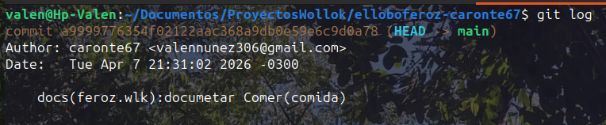

#Repositorio grupla de Taller de enmarcado

Este es una carpeta de los trabajos del grupo.
recuerden siempre hacer git pull y mandar un
mensaje que hicieron cambios

#Comision 04:

        #Grupo de taller enmarcado
        -SEBASTIAN IGNACIO MONTERO
        -Lucía Nicole Caro
        -Lautaro Brea
        -Nuñez Valentin Elias

#Ayuda
1.configurar
	vean su configuracion en su git : git config list

        accedan a una configuracion, pongan su nombre
        y correo electronico:
                git config user.name <nombre de usuario>
                git config user.email <email>

	añadi este repositorio:
	git remote add <un alias a la url> <url>

	vean si tiene un alias de un repositorio:
        git remote show
	
	ahora vea si ese alias tiene este link "
	https://github.com/caronte67/GrupoDeEnMarcado.git":
	git remote show origin
	
2.organizacion de commits
utilizaremos las etiquetas de Conventional Commits para comunicar cada cambio hecho 
en un commit.

fuente oficial : https://www.conventionalcommits.org/en/v1.0.0/

resumen:

estructuras de commits:
        1) ejemplo :
                tipo(archivo donde se hace el cambio):asunto de 
                cambio, en infinitivo 50 caracteres maximo

                [descripcion opcional] 100 caracteres maximo

        

        2) ejemplo :

        
                tipo: [describio del cambio] en infinitivo entre 50 caracteres maximo

Etiquetas:

        "feat" se añadio una nueva funcion

        "fix" se arreglo un error o bug

        "docs" se añadio o modifica la documentacion

        "chore" tarea rutirania, ejemplo: modificar gitignore o mover archivo de lugar.

        ⚠️
        "refactor" no arregla nada, no añade nada nuevo,  ejemplo: cambia el color de un boton.
        ⚠️

       

        "style" cambios en el codigo que no afecta la logica, ni el contexto o estado del codigo. solo afecta al codigo con espacios en blanco,
        tabulaciones, sangria, mas lineas vacias, menos linea vacias.

        "test" añade una version de testeo del proyecto
